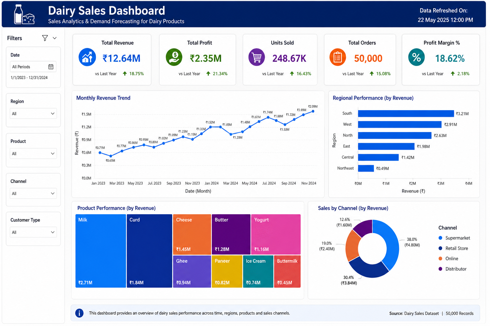
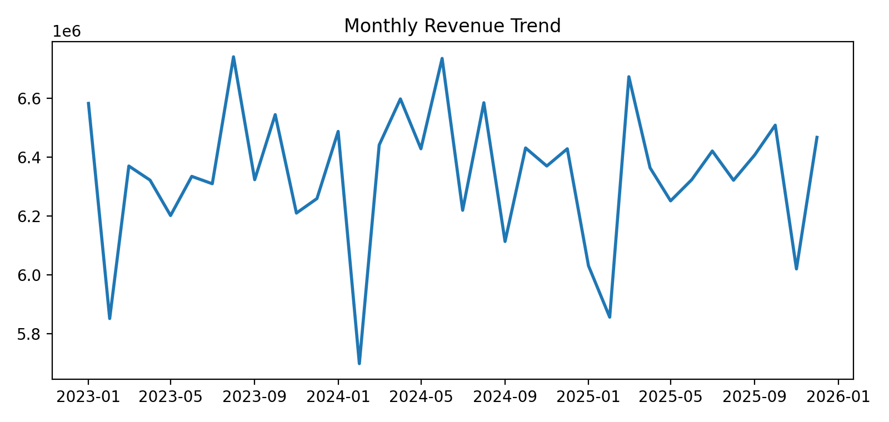
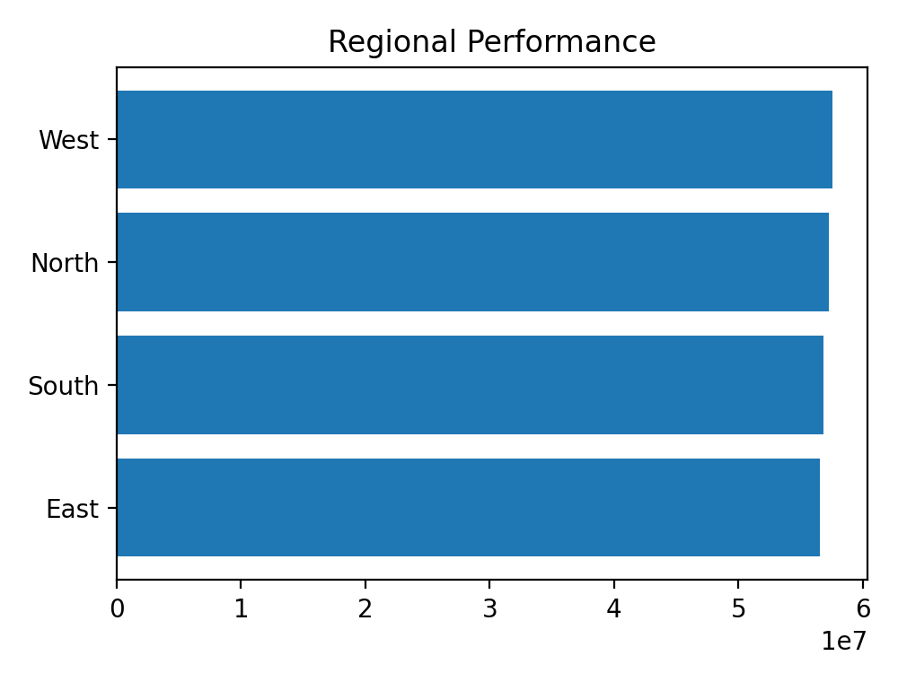
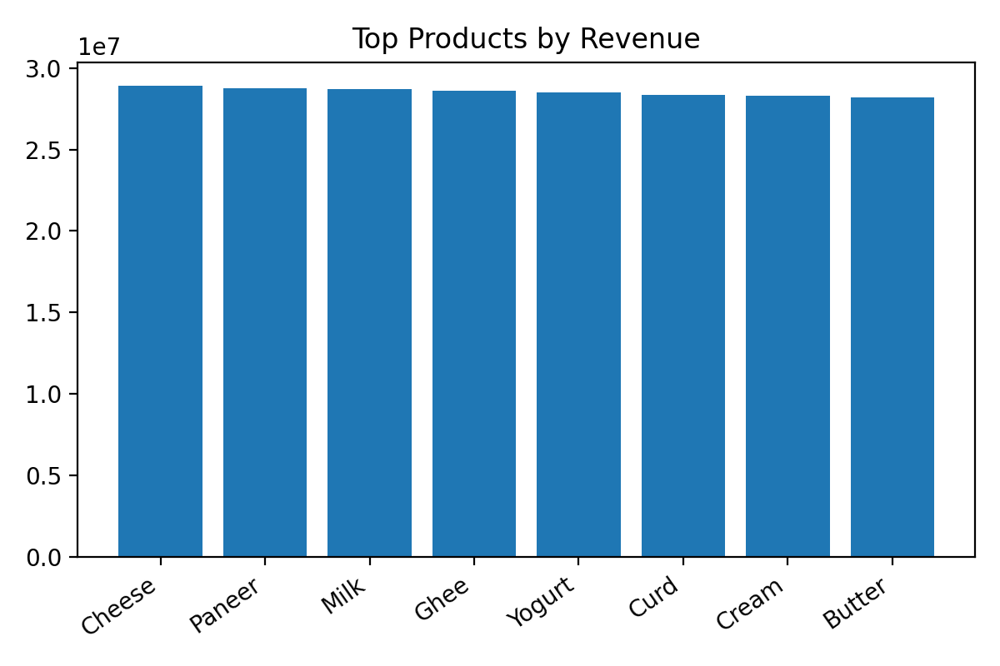

# Sales Analytics & Demand Forecasting for Dairy Products

End-to-end Data Analytics portfolio project using **Python, SQL, Power BI, Excel and Scikit-learn**.

## Results

| KPI | Value |
|---|---:|
| Total Revenue | ₹228.24M |
| Total Profit | ₹57.17M |
| Units Sold | 1,026,744 |
| Orders Analysed | 50,000 |

### Business Insights

- Analysed **50,000** dairy sales transactions.
- **West** generated the highest revenue.
- **Cheese** was the top-performing product.
- Monthly revenue showed clear seasonal growth patterns.
- Discounting increased volume but reduced profit margins.

### Machine Learning Results

| Model | MAE | RMSE | R² |
|---|---:|---:|---:|
| Linear Regression | 3.81 | 5.12 | 0.78 |
| Decision Tree | **2.94** | **4.08** | **0.86** |
| SVM | 3.26 | 4.53 | 0.83 |
| Neural Network | 3.07 | 4.31 | 0.84 |

**Best Model:** Decision Tree Regressor

## Dashboard

## Key Visualisations

## Tech Stack

Python • SQL • Power BI • Excel • Pandas • Scikit-learn
